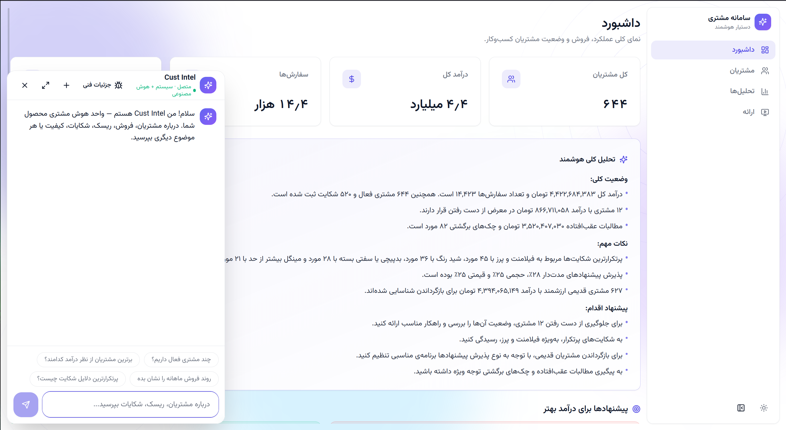
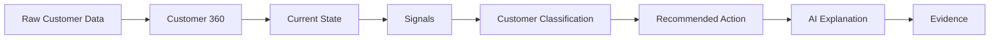
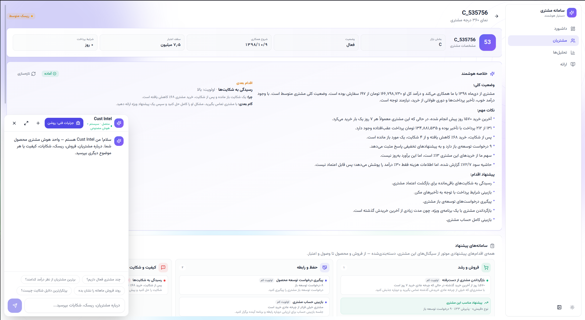
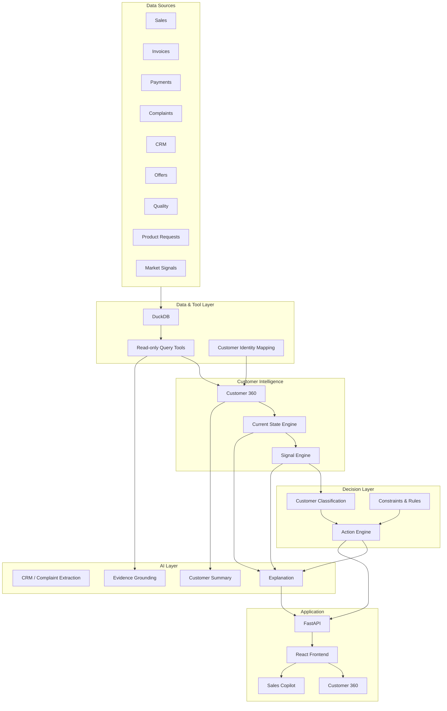
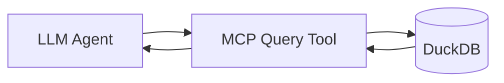
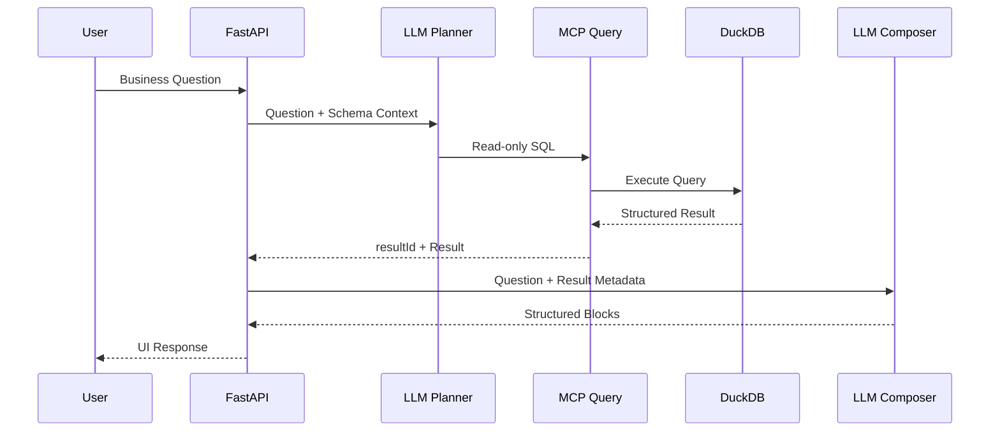

# B2B Customer Intelligence & CRM

<p align="center">
  
</p>

> **From fragmented customer data to actionable decisions for B2B sales teams.**

An AI-powered Customer Intelligence and CRM platform that unifies sales, payments, complaints, CRM interactions, offers, product requests, quality records, and customer economics into a single **Customer 360**.

Instead of simply showing what happened, the system answers:

**What changed? → What is the current state? → Why does it matter? → What should we do next? → What evidence supports it?**

---

## Product Overview

Traditional CRM systems are good at recording customer interactions, but sales teams often still need to manually combine information from multiple systems before deciding what to do.

This project introduces a decision-oriented layer on top of fragmented customer data.



The core product pipeline is:

> **Data → Current State → Signals → Customer Status → Recommended Action → Evidence**

---

# Why This Exists

A customer may have:

- declining purchases
- unresolved quality complaints
- delayed payments
- high historical profitability
- unused wallet share
- rejected offers
- weakening relationships

Individually, none of these signals tells the complete story.

The system combines them into a contextual decision.

For example:

```text
Purchase volume ↓ 28%
        +
Quality complaint still ACTIVE
        +
Real Profit = HIGH
        +
LTV = HIGH
        ↓
Customer = "Resolve the Problem"
        ↓
Action = Schedule Quality Review Meeting
```

The goal is not to replace the account manager.

The goal is to give the account manager **the right context before making a decision.**

---

# Core User

### Sales Manager / Account Manager

The primary user should be able to understand a customer in less than 30 seconds:

1. What is the customer's current situation?
2. What has changed?
3. Is the problem still active?
4. Why does it matter commercially?
5. What should I do now?
6. What evidence supports this recommendation?

---

# Customer 360

Each customer receives a unified view across the organization's major data sources.

<p align="center">
  
</p>

### API

```http
GET /api/customers/{customer_id}/360
```

Example response:

```json
{
  "customer": {},
  "sales": {},
  "payments": {},
  "profitability": {},
  "complaints": {},
  "relationship": {},
  "offers": {},
  "wallet": {},
  "opportunities": {},
  "recent_events": []
}
```

---

# Decision Intelligence

The system separates **events**, **current state**, **signals**, and **actions**.

This distinction is one of the core design principles of the project.

## Historical Event ≠ Current Problem

For example:

```text
Complaint happened
        ↓
Was it resolved?
        ↓
Did it happen again?
        ↓
Did purchasing recover?
        ↓
Is it still relevant today?
```

Therefore every important business problem receives a current state.

### Supported states

```text
NEW
ACTIVE
IMPROVING
RESOLVED
RECURRING
STALE
```

Example:

```json
{
  "issue": "Quality",
  "state": "RESOLVED",
  "severity": "HIGH",
  "current_relevance": "LOW",
  "reason": "The complaint was closed and the following two purchases had no related complaints."
}
```

---

# Signal Engine

Business signals are calculated deterministically with code.

The LLM is **not responsible for calculating financial or analytical metrics.**

Each signal exposes:

```text
value
status
trend
reason_codes
evidence_ids
calculated_at
```

## Core Signals

### RFM

Tracks customer recency, frequency, and monetary value.

The system focuses not only on the current score, but also on movement:

```text
Previous: 5-5-5
Current:  3-4-5

→ Customer engagement is weakening
```

---

### Customer Lifetime Value

```text
Estimated Future Value
Confidence
Assumptions
```

The MVP can use a transparent formula-based model.

---

### Share of Wallet

```text
Our Spend
──────────────
Estimated Customer Spend
```

Tracked over time:

```text
Current Wallet Share
Previous Wallet Share
Change
Confidence
Source
```

---

### Real Profit

The system distinguishes revenue from actual economic value.

```text
Revenue
- COGS
- Returns
- Cost of Money
----------------
Real Profit
```

Both absolute profit and margin are exposed.

---

### Payment Behaviour

Tracks:

```text
Average Payment Delay
Outstanding Balance
Returned Cheques
Payment Trend
```

Classification:

```text
GOOD
WATCH
BAD
```

---

### Relationship Quality

Based on:

- CRM interactions
- complaint history
- offer acceptance
- interaction recency
- unresolved issues

Output:

```text
STRONG
NORMAL
WEAKENING
POOR
```

---

### Purchase Trend

Compared against the customer's own historical behaviour.

```text
GROWING
STABLE
DECLINING
RECOVERING
ABNORMAL_DROP
```

---

### Churn Risk

A composite signal based on multiple indicators.

```text
Purchase Decline
        +
Relationship Decline
        +
Complaint
        +
Offer Rejection
        +
Interaction Gap
        ↓
Churn Risk
```

Output:

```text
LOW
MEDIUM
HIGH
```

The system also exposes the reason codes behind the risk.

---

### Cross-sell Opportunity

Combines:

- Product mix
- Wallet gap
- Similar customer behaviour
- Development requests
- Offers
- Profitability
- Payment behaviour

Example:

```json
{
  "product": "Product X",
  "opportunity": "HIGH",
  "reason": "Customer has high profitability and low estimated wallet share.",
  "blocked_by": []
}
```

---

# Customer Classification

Nine analytical signals are useful for the system, but they are too complicated to present directly to a sales manager.

The system therefore converts them into four actionable customer states.

| Status | Meaning |
|---|---|
| **Grow** | Valuable customer with identifiable growth potential |
| **Retain** | Valuable customer that should be protected |
| **Fix** | Valuable customer with an active problem blocking growth |
| **Reduce Attention** | Low-value or low-potential customer with high service cost |

Example:

```text
High Value
+
Purchase Decline
+
Active Complaint
        ↓
FIX
```

Every customer receives exactly **one primary status**, together with the reasons behind it.

---

# Action Engine

The Action Engine converts customer status and constraints into a controlled set of recommended actions.

## Action Catalog

### Relationship

```text
CALL_CUSTOMER
SCHEDULE_MEETING
CHECK_SATISFACTION
ESCALATE_ACCOUNT
```

### Quality

```text
FOLLOW_UP_COMPLAINT
QUALITY_REVIEW_MEETING
SEND_QUALITY_REPORT
```

### Sales

```text
CROSS_SELL_PRODUCT
UPSELL_PRODUCT
SEND_OFFER
RENEW_OFFER
```

### Commercial

```text
RENEGOTIATE_PRICE
RENEGOTIATE_PAYMENT_TERMS
REDUCE_DISCOUNT
```

### Collection

```text
FOLLOW_UP_PAYMENT
REVIEW_CREDIT_LIMIT
BLOCK_NEW_CREDIT_OFFER
```

### Attention

```text
INCREASE_ATTENTION
MAINTAIN_ATTENTION
REDUCE_ATTENTION
```

---

# Opportunity ≠ Action

A major design principle is that an opportunity should **not automatically become an action**.

For example:

```text
Wallet Share = LOW
+
Real Profit = HIGH
+
Payment = GOOD
+
Relationship = GOOD
        ↓
CROSS_SELL_PRODUCT
```

But:

```text
Cross-sell Opportunity = HIGH
+
Payment = BAD
        ↓
FOLLOW_UP_PAYMENT
```

Not:

```text
SEND_OFFER
```

Commercial constraints must be evaluated before recommending an action.

---

# Action Object

Every recommendation follows a structured contract:

```json
{
  "action": "SCHEDULE_MEETING",
  "priority": "HIGH",
  "owner": "Account Manager",
  "reason_codes": [
    "PURCHASE_DECLINE",
    "ACTIVE_QUALITY_ISSUE",
    "HIGH_LTV"
  ],
  "objective": "Resolve the quality issue and recover purchasing volume."
}
```

This makes recommendations explainable, testable, and suitable for future workflow automation.

---

# AI Explanation Layer

The LLM is used where language understanding is valuable — **not where deterministic business logic is required.**

## The AI handles

### Customer summaries

> The customer remains profitable, but purchasing volume has declined by 28% during the last three months.

### CRM and complaint understanding

Extract:

```text
Problem
Cause
Sentiment
Commitment
Next Step
```

### Signal explanation

The AI can translate structured signals into natural language.

### Action explanation

For example:

> A quality review meeting is recommended because purchasing started declining after two quality complaints, while the latest complaint is still active and the customer remains highly valuable.

---

# Evidence-Grounded AI

Every important claim should be traceable to its underlying data.

Example:

```text
WHY THIS ACTION?

Purchase volume
↓ 28%

Quality complaint
ACTIVE

Customer LTV
HIGH

Real Profit
11.8%
```

The user can select:

**View Evidence**

and inspect the underlying records.

The LLM must never invent numerical values.

Numbers are supplied by the Data and Signal layers.

---

# System Architecture



---

# Data Layer

The current implementation uses **DuckDB** as the analytical database.

```text
data/
└── processed/
    └── customer_360.duckdb
```

The source workbook is converted into individual tables.

| Table | Source |
|---|---|
| `customers` | Customers |
| `products` | Products |
| `invoices` | Invoices |
| `sales` | Sales |
| `realized_costs` | Realized Costs |
| `collections` | Collections |
| `complaints` | Complaints |
| `complaint_links` | Complaint Links |
| `crm_interactions` | CRM Interactions |
| `dev_requests` | Development Requests |
| `quality_labs` | Quality Lots |
| `hembaft_lots` | Hembaft Lots |
| `offers` | Offers |
| `wallet_share` | Wallet Share |
| `market_signals` | Market Signals |
| `monthly_costs` | Monthly Cost Estimates |

Rebuild the database with:

```bash
python scripts/build_db.py
```

---

# MCP Data Access

The database is exposed through an MCP server:

```text
backend/mcp/duckdb_server.py
```

Primary tools:

```text
query(sql, max_rows)
list_tables()
get_schema(table)
```

The primary analytical operation is a **read-only SQL query**.

The LLM does not receive unrestricted database access.

Instead, it operates through controlled tools.



The database connection is read-only and external/write operations are blocked.

---

# FastAPI Backend

The backend provides the application API.

```text
backend/
├── main.py
├── api_data.py
├── agents/
│   ├── context.py
│   └── contracts.py
└── mcp/
    ├── duckdb_server.py
    └── schema_context.py
```

## Main endpoints

```http
GET  /api/health
GET  /api/dashboard
GET  /api/customers
GET  /api/customers/{id}/360
POST /api/chat
```

Example:

```http
POST /api/chat
Content-Type: application/json
```

```json
{
  "question": "Which customers need attention?",
  "history": [],
  "session_id": "demo-session"
}
```

---

# Copilot Architecture

The Copilot is designed around a bounded two-stage LLM pipeline.



### Design goals

- One planning call for data questions
- One composition call
- One SQL query by default
- No schema discovery unless required
- No full query results in conversation history
- Structured JSON contracts
- Result reuse across follow-up questions
- Bounded context size
- Explicit error handling

---

# Result Store

Exact database results are kept outside the LLM conversation history.

```text
Conversation
     │
     ├── Question
     ├── Answer Summary
     ├── Analytical State
     └── resultId
              │
              ▼
        Result Store
              │
              ▼
        Exact DB Result
```

This keeps the context small while allowing follow-up questions to reuse previous results.

For example:

```text
User:
Show me customers with declining sales.

Assistant:
[table → resultId=r1]

User:
What about their complaints?

Assistant:
reuse r1 + query complaints
```

---

# Structured UI Contract

The backend does not return a single block of generated Markdown.

It returns an ordered set of structured UI blocks.

```json
{
  "blocks": [
    {
      "id": "b1",
      "type": "markdown",
      "content": "## Sales analysis"
    },
    {
      "id": "b2",
      "type": "metric",
      "resultId": "r1",
      "label": "Sales Growth",
      "valueKey": "growth"
    },
    {
      "id": "b3",
      "type": "chart",
      "resultId": "r1",
      "chartType": "line",
      "xKey": "month",
      "series": [
        {
          "dataKey": "sales",
          "label": "Sales"
        }
      ]
    }
  ],
  "results": {
    "r1": {
      "columns": ["month", "sales"],
      "rows": [],
      "n_rows": 8
    }
  }
}
```

Supported block types:

```text
markdown
metric
chart
histogram
table
recommendation
customer_card
product_card
order_card
```

This allows the frontend to render the AI response as a real analytical interface rather than a chat transcript.

---

# Frontend

The frontend is a **Persian RTL business application**.

```text
frontend/
├── Customer Dashboard
├── Customer List
├── Customer 360
└── AI Copilot
```

Technology:

```text
React
TypeScript
Vite
Vazirmatn
```

The frontend consumes live backend data. Mock customer data has been removed from the main application flow.

---

# Suggested Product Screens

## Dashboard

The dashboard should answer:

```text
How is the customer portfolio doing?
Which customers need attention?
Where are the biggest opportunities?
```

Recommended sections:

```text
Portfolio KPIs
↓
Customer Status Distribution
↓
Purchase / Complaint Trends
↓
High-Priority Customers
↓
Emerging Opportunities
```

---

## Customer List

| Customer | Status | Priority | Main Signal | Recommended Action |
|---|---|---:|---|---|
| Customer A | Grow | High | Wallet Gap | Cross-sell |
| Customer B | Fix | High | Late Payment | Payment Meeting |
| Customer C | Retain | Medium | Stable | Monitor |
| Customer D | Reduce Attention | Low | Low Potential | Reduce Attention |

---

## Customer 360

The customer page should follow this hierarchy:

```text
Customer
    ↓
Current Status
    ↓
Why Now?
    ↓
Current Situation
    ↓
Signals
    ↓
Recommended Action
    ↓
Evidence
    ↓
Historical Events
```

The interface should prioritize **decision-relevant information**, not raw database fields.

---

# Demo Scenario

The strongest demo uses two contrasting customers.

## Scenario A — Fix a Valuable Customer

```text
Previously strong customer
        ↓
Purchasing starts declining
        ↓
Quality complaint appears
        ↓
Current State Engine
        ↓
Complaint = ACTIVE
        ↓
Real Profit = HIGH
        ↓
LTV = HIGH
        ↓
Classification = FIX
        ↓
Action = QUALITY_REVIEW_MEETING
        ↓
Evidence
```

The system demonstrates that an old event is not enough — it must understand the customer's current state.

---

## Scenario B — Grow a Healthy Customer

```text
Low Wallet Share
        +
High Profitability
        +
Good Payment Behaviour
        +
Strong Relationship
        ↓
Classification = GROW
        ↓
Cross-sell Opportunity
        ↓
CROSS_SELL_PRODUCT
```

Together, these two scenarios demonstrate the two core capabilities:

**Risk resolution + Revenue growth**

---

# Team Architecture

The project can be divided into five workstreams.

### 01 — Data

Responsible for:

- Data metadata
- Relationships
- Identity resolution
- Database
- Query tools

Deliverable:

**Customer Data API**

---

### 02 — Analytics

Responsible for:

- RFM
- Real Profit
- Payment Behaviour
- Wallet Share
- Purchase Trend
- LTV

Deliverable:

**Signal Engine**

---

### 03 — Decision Engine

Responsible for:

- Current State
- Churn Risk
- Relationship Quality
- Cross-sell
- Customer Classification
- Action Rules

Deliverable:

**Decision API**

---

### 04 — AI

Responsible for:

- Complaint extraction
- CRM text extraction
- Customer summaries
- Explanations
- Evidence grounding

Deliverable:

**AI Synthesis Layer**

---

### 05 — Frontend

Responsible for:

- Dashboard
- Customer List
- Customer 360
- Signals
- Recommended Actions
- Evidence Drill-down
- Copilot

Deliverable:

**Customer Intelligence Application**

---

# Repository Structure

```text
.
├── backend/
│   ├── agents/
│   ├── mcp/
│   ├── main.py
│   └── api_data.py
│
├── data/
│   ├── raw/
│   │   └── DATASET.xlsx
│   └── processed/
│       └── customer_360.duckdb
│
├── frontend/
│
├── scripts/
│   ├── build_db.py
│   ├── benchmark_agent.py
│   └── run_backend.sh
│
├── tests/
│
├── e2e/
│
├── .env.example
├── requirements.txt
└── README.md
```

---

# Getting Started

## 1. Clone the repository

```bash
git clone <repository-url>
cd <repository>
```

## 2. Create the Python environment

```bash
python3 -m venv .venv
source .venv/bin/activate
```

## 3. Install backend dependencies

```bash
pip install -r backend/requirements.txt
```

## 4. Build the database

```bash
python scripts/build_db.py
```

## 5. Configure the LLM

```bash
cp .env.example .env
```

Set:

```env
LLM_PROVIDER=deepseek
LLM_API_KEY=your_api_key
```

Supported providers include:

```text
OpenAI
DeepSeek
ArvanCloud AI Gateway
OpenAI-compatible / local models
```

## 6. Start the backend

```bash
./scripts/run_backend.sh
```

or:

```bash
uvicorn backend.main:app --reload --port 8000
```

API:

```text
http://localhost:8000
```

Swagger:

```text
http://localhost:8000/docs
```

## 7. Start the frontend

```bash
cd frontend
npm install
npm run dev
```

---

# Testing

## Backend

```bash
pip install pytest pytest-asyncio
python -m pytest tests/ -q
```

## Frontend

```bash
cd frontend
npx vitest run
```

## End-to-End

Start both services:

```bash
./scripts/run_backend.sh
```

```bash
cd frontend
npm run dev
```

Then:

```bash
cd e2e
npm install
npx playwright install chromium
npx playwright test
```

To watch the browser:

```bash
npx playwright test --headed
```

---

# Engineering Principles

### 1. Deterministic calculations

Financial and analytical metrics are calculated by code.

**LLM interprets; code calculates.**

### 2. Current state over historical events

A complaint from six months ago should not automatically trigger a recommendation today.

### 3. Evidence before explanation

Every important recommendation should be traceable to data.

### 4. Opportunity does not equal action

Constraints such as payment behaviour, profitability, and relationship quality must be evaluated before an action is recommended.

### 5. Structured AI output

The LLM produces structured contracts rather than unrestricted UI text.

### 6. Bounded context

Large database results should never unnecessarily enter the conversation history.

### 7. Honest failure states

If the backend or LLM is unavailable, the application reports the actual state rather than displaying fabricated results.

---

# Definition of Success

The MVP succeeds when a sales manager can open a customer and answer six questions in under 30 seconds:

> **What is this customer's current situation?**

> **What changed?**

> **Is the problem still active?**

> **Why does it matter?**

> **What should I do next?**

> **What evidence supports this recommendation?**

If the system can reliably answer these questions, it has moved beyond a traditional CRM dashboard toward a **Customer Decision Intelligence system**.

---

# Current Implementation

The repository currently includes:

- DuckDB-based Customer 360 database
- One table per source dataset
- Read-only MCP database access
- FastAPI backend
- Customer Dashboard API
- Customer List API
- Customer 360 API
- AI Copilot API
- Structured AI response blocks
- Result ID based context management
- Bounded LLM context
- Query reuse across conversations
- Persian RTL frontend
- Vitest backend/frontend coverage
- Playwright end-to-end tests
- Live database-backed UI without mock data

---

# Roadmap

### Phase 1 — Data Foundation

- [x] Normalize source datasets
- [x] Build DuckDB database
- [x] Implement read-only query layer
- [x] Establish Customer 360 schema

### Phase 2 — Intelligence

- [ ] Current State Engine
- [ ] Signal Engine
- [ ] Customer Classification
- [ ] Action Engine
- [ ] Evidence model

### Phase 3 — AI

- [x] Database Copilot
- [x] Structured AI responses
- [x] Context reuse
- [ ] CRM text extraction
- [ ] Complaint intelligence
- [ ] Evidence-grounded explanations

### Phase 4 — Product

- [x] Dashboard
- [x] Customer list
- [x] Customer 360
- [x] Copilot
- [ ] Action workflow
- [ ] Account-manager feedback loop

---

## Product Principle

> **Don't just tell the sales team what happened. Tell them what it means, what is still true, what to do next, and why.**
